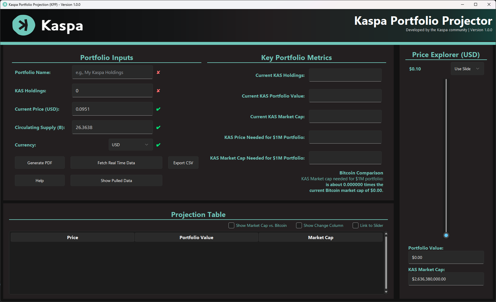
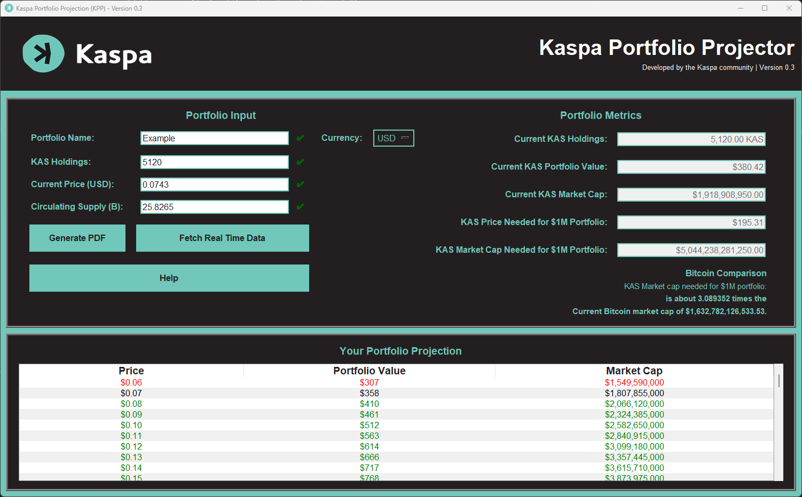
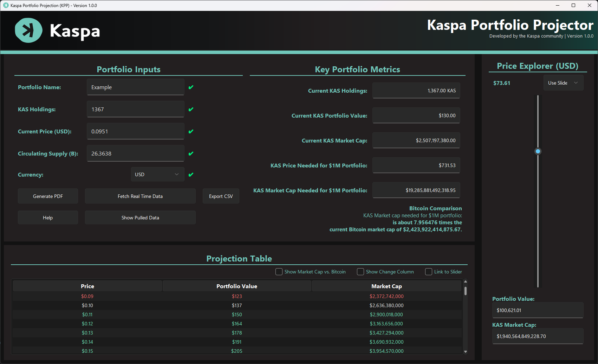

# Kaspa Portfolio Projection (KPP) - GUI Application

A Python application for generating Kaspa portfolio projections and reports. This tool provides a user-friendly GUI where users can input their Kaspa holdings, current market price, and circulating supply to generate a comprehensive portfolio projection report. The application also automatically fetches real-time Kaspa price data, circulating supply, Bitcoin market cap, and exchange rates from CoinGecko and a currency FX API, with robust error handling and status feedback. Users can export detailed projections in both PDF and CSV formats.

## Features

- Automatically fetches real-time Kaspa price, circulating supply, Bitcoin market cap, and fiat exchange rates on startup.
- Safe API calls with timeouts, caching, and graceful fallback handling.
- Generates price intervals for Kaspa using both linear and logarithmic scaling.
- Computes portfolio value and market capitalization at various price points.
- Provides an interactive, modern dark-themed graphical interface with improved section headers, centered titles, and clearer labels.
- Displays portfolio projections in a sortable table with color-coded price levels, percentage change, and Market Cap vs. BTC.
- Exports professional-grade PDF reports including a price table and key portfolio metrics, plus optional CSV export.
- Supports multiple currencies (USD, EUR, BTC, and more) for price and portfolio value conversions, updated automatically via FX API.
- Features a price slider panel that synchronizes instantly with portfolio inputs for real-time portfolio projections.
- Includes a full-width status bar with a progress indicator and task-specific messages for background operations (e.g., data fetching, file saving).
- Allows copying table cell values to clipboard via double-click for quick sharing.

## Installation

Ensure you have Python installed on your system. Then, install the required dependencies:

```sh
pip install pandas fpdf numpy pillow tkinter pycoingecko reportlab requests logging
```

<details>
<summary><strong>Getting Python on Windows</strong> (Click to expand)</summary>

If you do not have Python installed on your Windows computer, follow these steps:

1. Visit the official Python website: [https://www.python.org/downloads/windows/](https://www.python.org/downloads/windows/)
2. Download the latest stable version of Python.
3. Run the installer and ensure you check the box **"Add Python to PATH"** before proceeding with the installation.
4. Verify the installation by opening Command Prompt (`cmd`) and running:
   ```sh
   python --version
   ```
   If Python is installed correctly, it will display the installed version number.

</details>

## Usage

1. Clone this repository or download the script.
2. Run the script using Python:

   ```sh
   python kpp.py
   ```

3. Enter the required portfolio details in the GUI or fetch real-time data.
4. Use the price slider or direct input to explore projections.
5. Click **Generate PDF** or **Export CSV** to save your portfolio projection report.

## Requirements

This script requires the following Python libraries:
- `pandas` (for handling tabular data)
- `reportlab` (for PDF report generation)
- `numpy` (for price interval calculations)
- `tkinter` (for the GUI application)
- `PIL (Pillow)` (for image handling in the GUI)
- `pycoingecko` (for real-time price fetching)
- `requests` (for fetching FX rates)
- `logging` (for error tracking and debugging)

## Examples

### Main Application GUI


### Main Application GUI - Filled In


### Main Application GUI - Filled In with Linked Slider in use and additional columns added to chart


### Sample PDF Report


## Compiled Executable

If you would like a compiled executable, install the required dependencies for compiled executable generation:

```sh
pip install pyinstaller
```

I've compiled the Python application into an executable that can be run using the following command:
   ```sh
   pyinstaller --noconsole --onefile --name="Kaspa Projection Projection (KPP)" `
   --icon="pics\kaspa.ico" `
   --add-data "pics\kaspa.ico;pics" `
   --add-data "pics\Kaspa-LDSP-Dark-Full-Color.png;pics" `
   --add-data "pics\Kaspa-LDSP-Dark-Reverse.png;pics" `
   kpp.py
   ```

The compiled file can be found in the `compiled/` directory. A checksum is included for verification.

## Contributing

Contributions are welcome! Feel free to submit a pull request or open an issue.

## License

This project is open-source and maintained by the Kaspa community.

## Acknowledgments

Special thanks to the Kaspa community for supporting open-source development.

---

Developed by the Kaspa Community 🚀
